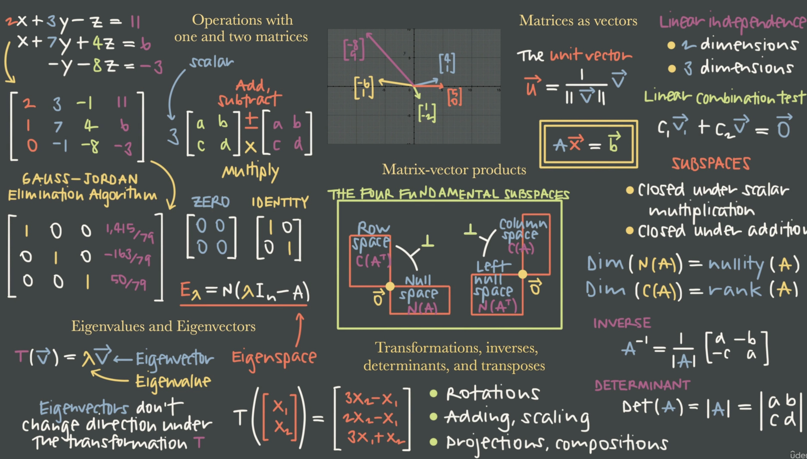
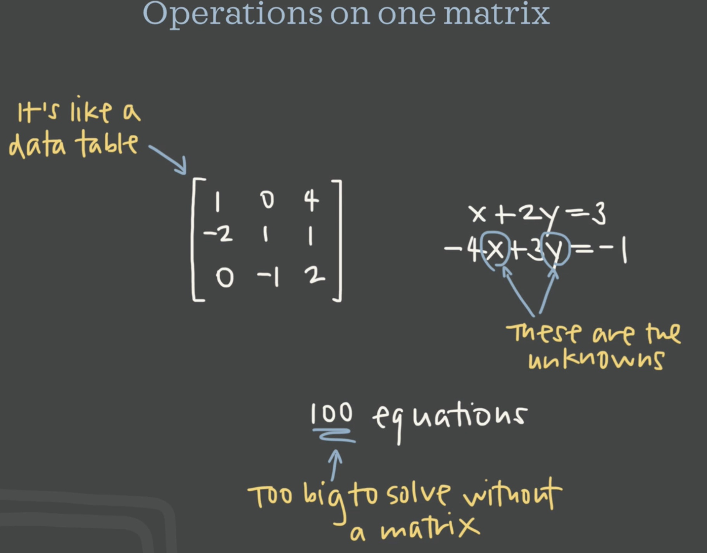
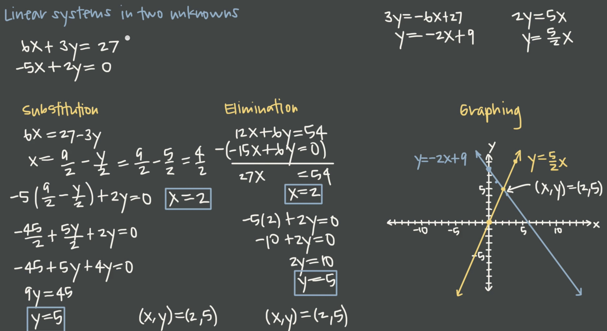

# linear-algebra
this is course of linear algebra from udemy<br>
https://www.udemy.com/course/linear-algebra-course/learn/lecture/37511084#overview<br>


# 0. Clutter
1. translate
```bash
Cartesian coordinate    笛卡尔坐标
determinant             行列式
slope intercept form    斜截式
```

# 0. Intro

1. course content
    - 

<br><br><br><br><br><br>

# 2. Operations on one matrix
1. intro
    - 

2. linear system in two unknowns
    - substitution method
    - elimination method
    - graphing method
    - 
    - 